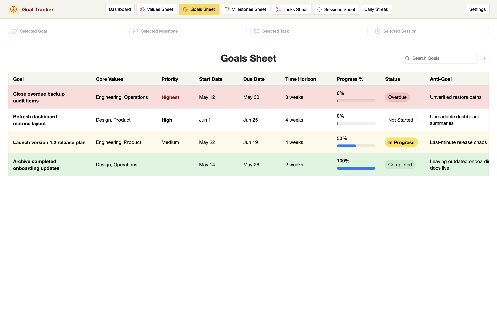

# Goal Tracker

Goal Tracker is a native macOS SwiftUI app for Values, Goals, Milestones, Tasks, Sessions, Daily Streak, and Dashboard focus tracking.

## Screenshot

The screenshot below uses an in-memory preview mode with synthetic data, so no personal app data is shown.



## Build

Requirements:

- macOS 14 or newer
- Xcode command line tools with `swiftc`
- `iconutil` available on the system

Build and run the app bundle:

Use the project-local run script:

```bash
./script/build_and_run.sh
```

The script compiles the SwiftUI/Core Data app with `swiftc`, generates the app icon, stages a signed `.app` bundle in a temporary local build folder, and launches it as a normal macOS app bundle. Release zip artifacts are written to `dist/`. The Codex Run action is wired to the same script.

Useful modes:

```bash
./script/build_and_run.sh --verify
./script/build_and_run.sh preview-goals
./script/build_and_run.sh --check
./script/build_and_run.sh --package
```

`--verify` confirms the app launches successfully. `preview-goals` opens the README preview window using synthetic in-memory data. `--check` runs the built-in regression suite. `--package` produces a release zip archive in `dist/` and prints the staged signed `.app` path.

## Production Release

The build script now stages and signs the app bundle before every launch, and it can produce a release artifact suitable for Developer ID signing and notarization.

Release metadata lives in `script/build_settings.sh`. The defaults are safe to run locally, and you can override them per build with environment variables:

```bash
GOAL_TRACKER_BUNDLE_ID="com.example.GoalTracker"
GOAL_TRACKER_APP_VERSION="1.0.0"
GOAL_TRACKER_BUILD_VERSION="42"
GOAL_TRACKER_SIGNING_IDENTITY="Developer ID Application: Your Name (TEAMID)"
GOAL_TRACKER_NOTARY_PROFILE="goaltracker-notary"
```

Release commands:

```bash
./script/build_and_run.sh --release
./script/build_and_run.sh --package
./script/build_and_run.sh --notarize
```

`--release` builds and validates the release `.app` and prints its staged path. `--package` also creates a zip archive. `--notarize` submits that archive with `notarytool`, staples the result, and rebuilds the zip with the stapled app.

## Persistence

Data is stored locally with Core Data in Application Support under `Goal Tracker/GoalTracker.sqlite`. The app is offline-first and does not require login or a backend.

If you have existing settings from older development builds that used the `local.goaltracker.app` bundle identifier, the app now migrates those `GoalTracker.*` preferences automatically on first production launch.

Core Data stores tracker data only: Values, Goals, Milestones, Tasks, and Sessions. UI preferences such as theme, filters, selected focus, delete confirmations, session-date confirmation, and backup toggles are stored in macOS preferences through SwiftUI `@AppStorage`.

## Data Safety

Goal Tracker includes mirrored JSON backup support for iCloud Drive:

- Automatic JSON backups are written to both `iCloud Drive/Goal Tracker/Backups/Auto` and `iCloud Drive/Vault/Backups/Goal Tracker/Auto`.
- Manual JSON backups are written to both `iCloud Drive/Goal Tracker/Backups/Manual` and `iCloud Drive/Vault/Backups/Goal Tracker/Manual`.
- Before restoring a JSON backup, the app attempts a pre-restore backup in both `iCloud Drive/Goal Tracker/Backups/Pre-Restore` and `iCloud Drive/Vault/Backups/Goal Tracker/Pre-Restore`.
- The automatic backup folder keeps the latest 30 automatic JSON backups.
- The manual backup folder keeps the latest 20 manual JSON backups.
- Every JSON backup includes `schemaVersion` and `appVersion`.
- JSON backups are decoded and verified immediately after writing before they are treated as successful.
- Settings includes a Data Health check for entity counts, invalid dates, overlapping Milestone ranges, broken relationships, and negative minute values.
- CSV export is available as a readable fallback, but JSON is the restore format.

## Included

- Top tabs for Dashboard, Values Sheet, Goals Sheet, Milestones Sheet, Tasks Sheet, Sessions Sheet, Daily Streak, and Settings
- Core Data models for Values, Goals, Milestones, Tasks, Sessions, and Settings
- CRUD for Values, Goals, Milestones, Tasks, and Sessions
- High, Medium, and Low Goal priorities
- Goal and Milestone Due Date labeling with computed Goal planning status
- Session-weighted progress: Partial Sessions count as 0.5, Completed Sessions count as 1, then roll up through Tasks, Milestones, and Goals
- Read-only Dashboard and Daily Streak views
- Demo data reset and clear-all controls
- JSON import/export and CSV export
